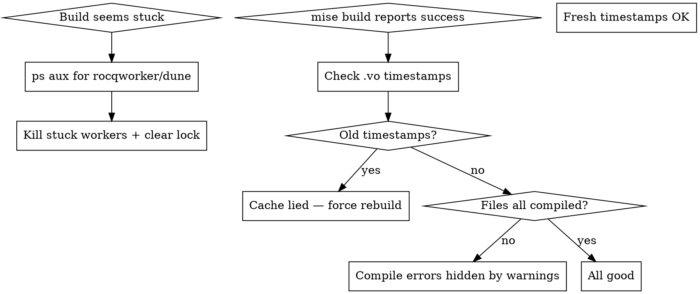

# Coq Build Doctor

Recovery playbook for stuck or misleading Coq builds.

## Symptom → diagnostic flowchart



## Common failure modes

### Mode 1: Stuck rocqworker (build runs forever)

**Diagnose:**
```bash
ps -ef | grep rocqworker | grep -v grep | awk '{print $2, "ETIME:", $5, $6, "CPU:", $7, $NF}'
```

If a worker has been running >30 min on a single file at 99% CPU:

**Fix:**
```bash
ps -ef | grep -E "rocqworker|dune" | grep -v grep | awk '{print $2}' | xargs -I{} kill -9 {}
rm -f _build/.lock
```

Then either fix the slow file (use `coq-cascade-split-pattern`) or commit and proceed.

### Mode 2: Silent build skip

`mise run build <file>.v` returns success without doing anything because dune sees the .v target as "not a build target."

**Diagnose:**
- After running `mise run build`, check `_build/default/<path>/<file>.vo` timestamp.
- If unchanged from before the run, the build didn't happen.

**Fix:** Target the `.vo` through the wrapper: `bash .claude/scripts/timed-build.sh 300 <file>.vo 2`. This is the correct invocation.

### Mode 3: Stale cache claims success

`mise build` exits 0 because all .vo files are up-to-date in cache, but the cache reflects an OLD version of a .v file.

**Diagnose:**
- After modifying a .v file, check its mtime is newer than its .vo.
- `ls -la <file>.v _build/default/<file>.vo` and compare.

**Fix:** 
```bash
touch <path>/<file>.v  # force re-compile
bash .claude/scripts/timed-build.sh 1800 @all 4
```

Or for a hard reset:
```bash
mise run clean
bash .claude/scripts/timed-build.sh 1800 @all 4  # full rebuild
```

### Mode 4: Lock file held by dead process

Symptom: `dune build` exits silently or hangs at startup.

**Diagnose:**
```bash
ls -la _build/.lock
# if file exists but no process owns it
```

**Fix:**
```bash
rm -f _build/.lock
```

### Mode 5: Hidden compile error behind warnings

The "previously bound to ... remapped to ..." warnings flood the output and hide a real error 10 lines down.

**Diagnose:**
```bash
mise build 2>&1 | grep -E "^Error|^File.*[Ee]rror"
```

**Fix:** Address the error in the named file. Common ones:
- "The variable X was not found in the current environment" → identifier typo or scope leak.
- "Hypothesis X expected" → missing apply argument.
- "Could not unify ... with ..." → goal mismatch.

## Bisecting a broken build

When the latest commit doesn't build but you don't know which earlier commit broke it:

```bash
# Save current state
git stash

# Find a known-green commit
git log --oneline | head -20

# Test each:
for commit in <suspect commits>; do
  git checkout $commit
  bash .claude/scripts/timed-build.sh 600 @check 4  # FAST vos build (no Qed verification)
  echo "Commit $commit: exit $?"
done

# Restore
git checkout <working-branch>
git stash pop
```

`dune build @check` uses .vos (type-check only, no Qed). Completes in 1-2 min for the full project. Use this to bisect.

## Verification protocol

After ANY commit that should preserve a green build:

1. `bash .claude/scripts/timed-build.sh 1800 @all 4` (or `… @check 4` for the
   fast vos version). The wrapper enforces the timeout + memory cap — never run
   bare `mise build`/`dune` (no limits → OOM risk).
2. Check exit code (0 ok, 124 timeout, 137 memory-kill) AND verify .vo files
   were actually produced/refreshed.
3. If any concern, examine `_build/log` for warnings/errors.

## When to give up and revert

If 3 consecutive recovery attempts fail:
1. `git stash`.
2. `git reset --hard <last-known-green-commit>`.
3. `mise run clean`.
4. `bash .claude/scripts/timed-build.sh 1800 @all 4` to confirm restoration.
5. Replan the change.

Better to lose recent work than to push broken code forward.

## Useful commands cheatsheet

All builds go through `TB` = `bash .claude/scripts/timed-build.sh <secs> <target> [jobs] [mem_mb]`
(enforces timeout + memory cap; exit 124 = timeout, 137 = memory-kill):

| Command | Purpose |
|---------|---------|
| `TB 1800 @all 4` | Full project Qed-verified build |
| `TB 1800 @check 4` | Fast vos build (type-check only) |
| `TB 300 <file>.vo 2` | Single-file Qed-verified build |
| `TB 600 <heavy>.vo 1` | Memory-heavy cascade file (single worker) |
| `mise run clean` | Clear `_build/` cache (no compile) |
| `rm -f _build/.lock` | Clear stuck lock |
| `ps -ef | grep rocqworker` | Find Coq workers |
