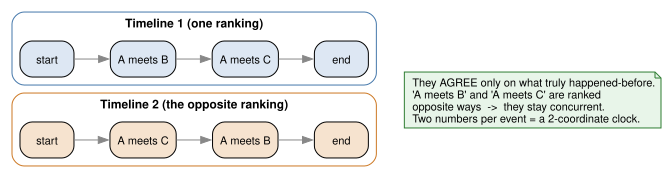
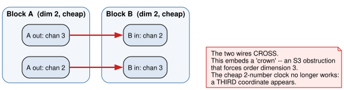
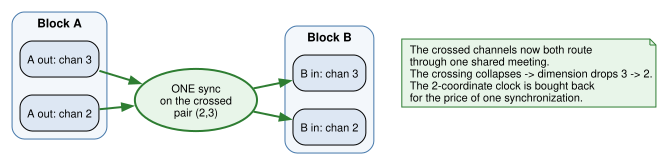
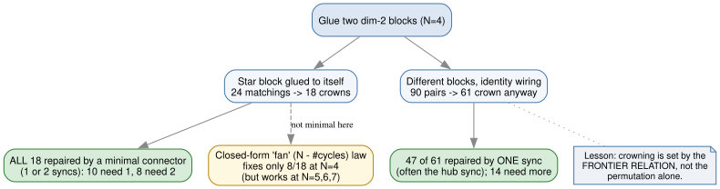
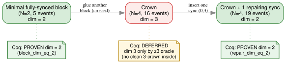

# The repairing sync: buying back a cheap clock with one meeting

*Who this is for: engineers and scientists who are comfortable with distributed
systems and a little discrete math, but not with order-dimension theory or this
project's notation. No prior reading required — everything is built up from
scratch.*

---

## The hook

You have two pieces of a distributed system, each cheap to timestamp: every
event needs only **two numbers**, not one-per-process. You glue them together,
end to end, expecting the result to stay cheap.

Usually it doesn't. Gluing two cheap things tends to create a **crown** — a
specific tangle that forces a *third* number onto every timestamp. But there's a
fix, and it is almost comically small: **one well-placed synchronization** — a
single extra meeting between two of the processes — collapses the crown and
restores the two-number clock.

This session produced two things about that fix. First, an **exhaustive
empirical map** of when crowns appear and exactly which one-sync repair undoes
them. Second — and this is the part that turns a measurement into a guarantee —
the positive side is now **machine-checked in the Coq proof assistant**,
admit-free: a minimal cheap block and a crown's one-sync repair each provably
have dimension exactly 2.

Let's build up to why any of that is interesting.

---

## The setup: meetings, causality, and the cost of telling time

Here is the entire model. You have **N processes** — picture N people, each on
their own timeline, doing one thing after another. Occasionally two of them
**synchronize**: they meet, swap everything they each know, and carry on. A
synchronization is just a pair of people; an *execution* is N people plus an
ordered list of these pairwise meetings.

Each meeting weaves two timelines together. After A and B meet, everything in
A's past is now also in B's past, and vice versa. So an execution fans out into
a web of events where some provably **happened before** others (linked through a
chain of meetings) and some are **concurrent** (neither could have influenced
the other). That "definitely came before" relation is the classic
**happened-before** order from distributed systems — a *partial* order, because
not every pair of events is comparable.

Why does anyone care how tangled that web is? Because of **timestamps**. In a
distributed system you often want each event to carry a stamp that lets any two
events be compared: did X happen before Y, or were they concurrent? The standard
tool is the **vector clock** — give each event one coordinate per process, so
**N numbers per event**. It works, but that linear cost is a real burden as
systems grow. The north star of this whole project is to beat it: find clocks
that cost **fewer than N** numbers per event.

The lever is a number called the **order dimension** of the happened-before
poset. Skip the formal definition; here is the operational meaning that matters:

> The order dimension is **exactly** the number of coordinates a minimal clock
> needs. A poset of dimension *d* can be faithfully timestamped with *d* numbers
> per event — not *N*.

So "dimension 2 vs dimension 3" is literally "two-number clock vs three-number
clock." Dimension 2 is the prize: a **2-coordinate clock that works regardless
of how many processes there are.**

### What a dimension-2 clock actually is

Dimension 2 means the true happened-before order can be reconstructed as the
**agreement of two ordinary timelines**. Lay every event out in a line twice, in
two different rankings; then say "X is before Y" only when *both* rankings agree.
Those two rank-positions are the two clock coordinates, and componentwise "≤"
*is* the causality test.

When everyone's opening news reaches everyone by the end — the executions this
project calls **fully synchronized** — the cheapest such executions are
dimension 2. Those are the cheap **blocks** we want to keep cheap when we
combine them.

---

## The crown: gluing two cheap blocks turns expensive

Now glue block A to block B. A finishes with four output channels; B starts with
four input channels. To compose them you wire A's outputs to B's inputs — but
the channels are an *unordered* set, so there are many ways to wire them. Each
wiring is a **matching**.

Most matchings betray you. Try the star block glued to *itself*, but with two of
its channels swapped, and the wires **cross**:

That crossing is the crown. It embeds an S₃-type obstruction — the smallest
structure that genuinely needs three independent viewpoints — and it forces the
order dimension up to **3**. The blocks were each dimension 2 and innocent; the
*wiring* is what created the cost. A silent third clock coordinate, born from
how you glued.

This is not a rare accident. In the exhaustive N=4 sweep, only **28%** of
wirings stay dimension 2; the other **72%** crown. (Background and the full
sweep: `nomadim/data/frontier-sync/EXPLAINER_RESCUE.md`.)

---

## The repair: one sync, on exactly the crossed pair

Here is the heart of the piece. Instead of wiring A's outputs *directly* to B's
inputs, slip a short **connector** of one or two extra meetings in between. The
connector re-mixes the channels before B runs.

For the simplest crowns — those born from a matching that just swaps two
channels — the fix is a single meeting, placed on **exactly the pair of
processes that the matching crossed**:

The crossed channels now both pass through one shared meeting; the crossing has
nowhere to go, and the order falls back to two dimensions. **One synchronization
is the entire difference between a three-number clock and a two-number clock.**
The marquee witness, verified by both the z3 SMT oracle *and* nomadim's
independent brute force, is the star block, a single `(1,2)` connector, then the
star block again — dimension 2. Remove that middle `(1,2)` and you are back to
the dimension-3 crown.

---

## What the session actually measured (and where it gets subtle)

The empirical headline is clean, but the honest findings underneath it have
three twists worth carrying faithfully. All of this is from
`nomadim/data/frontier-sync/CLOCK_RESULTS.md`, decided by the z3 SMT dimension
oracle and cross-checked by nomadim's brute force — **measured, not proven as a
universal theorem.**

**1. Every crown is repaired by a *minimal* connector — but it has to be the
right one.** The star block glued to itself gives 18 crowns across its matchings,
and *all 18* are repaired by a connector of length ≤ 2 (10 of them need 1 sync,
8 need 2). The repairing sync is not arbitrary: it targets the crown's **actual
crossed pair**, which is often a sync involving the hub.

**2. The pretty closed-form law is *not* the minimal repair at N=4.** There is a
clean candidate formula from the companion writeup — the "fan" law, recovery
length = N − (number of cycles in the matching). It is genuinely elegant and it
is a real achievable bound. But at N=4 it is **not minimal**: the fan repairs
only **8 of the 18** star-self crowns. The true minimal repair is the search-found
sync on the crown's specific crossed pair (often hub-involving), which fixes all
18. Interestingly, the fan law *does* work at N=5, 6, 7 on the cases tested — so
N=4 is a small-N anomaly where the clean formula undershoots and the
search-based repair wins on 10 of the 18.

**3. Even *identity*-wired different blocks crown.** You might hope that wiring
channels straight through (the identity matching, no crossing in the wiring
itself) would always stay cheap. It doesn't. Of 90 ordered pairs of *distinct*
blocks composed under the identity matching, **61 crown anyway**. The reason is
the deep one: the composed dimension is governed by the **frontier relation** —
the combined causal structure of both blocks plus the matching — **not by the
permutation alone**. Of those 61, 47 are repaired by a single inserted sync
(frequently the hub sync); the remaining 14 need a longer connector, whose exact
minimal length was not measured here.

So the faithful statement is: *a single well-placed sync repairs a large,
exhaustively-checked class of N=4 crowns; the minimal repair is the crossed
pair, not the closed-form fan; and crowning is a property of the full frontier
relation, which is why even identity wirings can crown.*

---

## The machine-checked finale

Empirical maps are persuasive, but the project's currency is **proof**. This
session moved the positive side of the story into the Coq proof assistant,
admit-free, on the *literal* nomadim posets from the experiment (source:
`execution_clock/witnesses/README.md`).

Two facts are now machine-checked:

- **The cheap block really is dimension 2.** `block_dim_eq_2` proves that a
  minimal fully-synchronized two-process execution (5 events) has dimension
  *exactly* 2 — Coq confirms the 2-coordinate clock genuinely characterizes
  happened-before, with an explicit two-timeline realizer.
- **The repaired crown really is back to dimension 2.** `repair_dim_eq_2` proves
  that the crown (N=4, 16 events) *with the repairing sync `(0,3)` inserted* (19
  events) has dimension exactly 2. So "the repairing sync restores the cheap
  clock" is no longer just an oracle reading — it is a theorem.

Both rest on a reusable bridge, `realizer_keys_dim_le2`: hand it two injective
key functions that move monotonically with the causal order, plus one
incomparable pair, and it produces the dimension-2 certificate. All assumptions
are standard Coq Stdlib axioms (classical logic, extensionality, choice — the
ordinary furniture); no `admit`, no `False`, nothing exotic.

### The honest gap

The **negative** side — that the bare crown has dimension *3* — is **not** proven
in Coq. It is defined (`W_crown_order`) and known to be dimension 3 from the z3
oracle, but the concrete Coq proof is **deferred**, for a real and specific
reason: these concrete 16-event crowns contain **no clean induced abstract
"3-crown" subposet** to certify against. Proving `dim ≥ 3` for this exact poset
needs an alternating-cycle critical-pair witness that has not yet been
formalized. The abstract *obstruction type* is proven separately
(`crown3_dim_ge_3`: the S₃-frontier poset has dimension ≥ 3, admit-free) — but
showing the concrete witness *contains* it is the open piece. So: **positive side
proven, crown's dim-3 side deferred.**

---

## Why it matters

Composition is how you would actually build a large execution out of small,
cheap ones. This result is both the warning and the remedy:

- **The warning:** gluing two dimension-2 blocks is, at N=4, *usually* a trap —
  most wirings crown and silently cost a third clock coordinate, and even
  identity wirings of different blocks crown most of the time.
- **The remedy:** the cost is repairable, and for a large exhaustively-checked
  class the price is a single, well-placed synchronization on the crown's crossed
  pair — restoring an exact 2-coordinate clock, now with the positive side
  machine-checked.

The dream behind all of this is a clock that costs roughly √N numbers per event
instead of N (for a thousand processes, ~45 coordinates rather than 1000). The
repairing sync is a concrete operation in service of that dream: keep your
composed executions dimension 2, and the cheap clock survives the gluing.

---

## The real artifacts

If you want the ground truth rather than this retelling:

- **Empirical results (the headline + all the honest caveats):**
  `nomadim/data/frontier-sync/CLOCK_RESULTS.md`
- **The Coq witnesses (proven dim-2 block + repair, deferred crown):**
  `execution_clock/witnesses/README.md` — theorems `block_dim_eq_2`,
  `repair_dim_eq_2`, bridge `realizer_keys_dim_le2`
- **Background on the 2-coordinate clock:** `execution/DIM2_CLOCK.md`
- **The companion crown/fan story (the N=5..8 fan law, the crossing structure):**
  `nomadim/data/frontier-sync/EXPLAINER_RESCUE.md` and its sibling
  `nomadim/data/frontier-sync/EXPLAINER.md`
- **Specs:**
  `docs/superpowers/specs/2026-06-04-pairwise-sync-repair-clock-design.md` and
  `docs/superpowers/specs/2026-06-05-repair-clock-coq-witnesses-design.md`

*Diagrams in this piece are schematic (authored as Graphviz DOT, rendered to
SVG); the dimension numbers and repair counts they illustrate come from the z3
SMT oracle and nomadim's brute force as recorded in `CLOCK_RESULTS.md`, and the
dim-2 claims for the block and repair are the Coq theorems above.*
