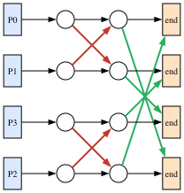
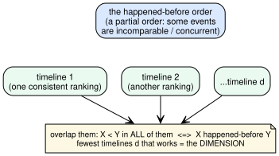
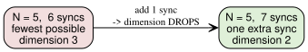
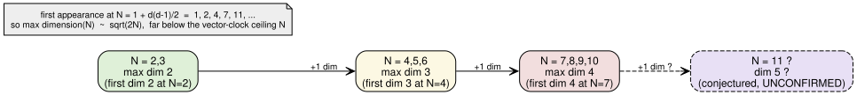
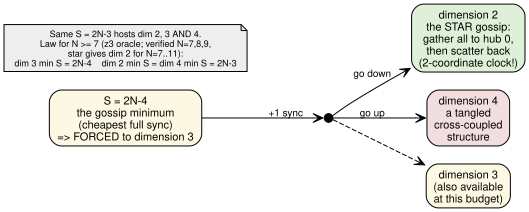

# When everyone has heard from everyone: how tangled does the story get?

*Who this is for: engineers and scientists comfortable with distributed systems
and a little discrete math, but not with order-dimension theory or this project's
notation. No prior reading required.*

---

## The hook

Picture a handful of people who can only learn things by talking to each other,
two at a time. You let them gossip until everyone's news has reached everyone
else. Then you ask a simple-sounding question: **how tangled is the resulting
web of "who-knew-what-before-whom"?**

There's a precise number for "how tangled" — the **order dimension** — and the
punchline is that it stays astonishingly small. With up to six people the tangle
never exceeds 3. The first time you genuinely *need* a tangle of 4 is at **seven
people**. And the size at which it first needs 2, then 3, then 4, lands exactly
on `2, 4, 7` — which is `1 + 0, 1 + 1, 1 + 3`, the **triangular numbers**. If
that law keeps holding, the tangle of a fully-gossiped crowd of `N` people grows
like `√N`, not like `N`.

Why anyone should care about `√N` versus `N` is the real story, and it's about
the **memory cost of tracking causality** in a distributed system. Let's build
up to it.

---

## The setup: gossip as a partial order

The objects of study come from a tiny model of a distributed system. You have
**N processes** — think of them as N people. Each person lives on their own
timeline, doing one thing after another. Occasionally two of them **synchronize**:
they meet, swap everything they each know, and then carry on. A synchronization
is just a pair of people, and an *execution* is N people plus an *ordered* list
of these pairwise meetings.

Each meeting weaves the two timelines together. After A and B sync, anything that
happened on A's timeline before the meeting is now also in B's past, and vice
versa. So an execution expands into a web of events where some events provably
came **before** others (they're connected through the chain of meetings) and
some are **concurrent** — neither could have influenced the other. That
"definitely came before" relation is the classic **happened-before** order from
distributed systems, and it is a *partial* order: not every pair of events is
comparable.

Here is one real execution from this dataset — four people, four meetings, in the
order (P0,P1), (P2,P3), (P0,P2), (P1,P3) (the file `N4_S4_dim3_real1000cap_01.yaml`):

The blue boxes on the left are everyone's *start*; the orange boxes on the right
are everyone's *last event*. This particular execution is **fully frontier
synchronized**: every person's start lies in the causal past of every person's
last event. In plain terms — by the end, everyone's opening news has reached
everyone. That "the whole opening frontier is seen by the whole closing frontier"
condition is the family of executions this folder studies.

---

## The idea: order dimension, the tangle number

So we have a partial order — some events before others, many concurrent. How do
we measure how complicated it is?

The trick is to ask: **how many simple timelines would you need to reconstruct
it?** A *single* timeline is a total ordering — line every event up, no ties. One
timeline can't capture concurrency, because it forces an order on events that
were really independent. But you can overlay several timelines and read off only
what they *agree* on. The **order dimension** is the smallest number of timelines
whose agreement reproduces the true order exactly: X comes before Y in *every*
timeline precisely when X really happened before Y.

Dimension 2 means two timelines suffice — a fairly flat, grid-like order.
Dimension 4 means you genuinely need four independent viewpoints before their
overlap pins down the truth; the order has a richer, more interlocked structure
that no three rankings can capture. **Bigger dimension = more tangled.**

### Why dimension is the whole point (the north star)

Here is the connection that makes this worth studying. In a distributed system
you often need each event to carry a timestamp that lets any two events be
compared for causality — "did X happen before Y, or were they concurrent?" The
standard tool is the **vector clock**: give each event an `N`-coordinate stamp,
one coordinate per process. It works, but it costs `Θ(N)` memory per event, and
that linear cost is a real burden as systems grow.

The order dimension is exactly the number of coordinates a *minimal* logical
clock needs. A poset of dimension `d` can be faithfully timestamped with `d`
numbers per event — not `N`. So **"is the dimension small?"** is literally the
question **"can we build a cheaper-than-vector clock?"** The vector clock gives a
free upper bound (dimension is never more than `N`), but if the real dimension
sits far below `N`, there's a much smaller clock waiting to be used. That gap is
the prize.

---

## Result A: more gossip can mean *less* tangle

Intuitively you'd expect that piling on more synchronizations only ever
complicates the causal web. The opposite happens.

Take five people. The *cheapest* way to get everyone fully in the loop uses **6**
meetings — and that minimal execution has dimension **3**. If you spend one
*extra* meeting (7 total), you can reach a *fully synchronized* execution of
dimension **2**. Adding a sync **lowered** the dimension.

The same pattern holds at N=4: the 4-sync minimum is dimension 3, while
dimension 2 costs 5 syncs. The intuition the researchers offer: when meetings are
scarce, *all* the causality has to funnel through a few hub events, and that
lopsided merge pattern is what forces a higher dimension. An extra meeting lets
the structure become more balanced and grid-like — and a balanced grid is exactly
what a 2-dimensional order looks like. **Fewer meetings → more skew → higher
dimension.** So "use the fewest syncs" and "keep the order simplest" are
*competing* goals, which is genuinely counterintuitive.

(One practical footnote from the findings: the default enumerator in this toolkit
throws away anything above dimension 2, so it never even *sees* these cheap
high-dimensional minima and over-reports how many syncs you need. The effect only
shows up once you keep every dimension.)

---

## Result B (the headline): the tangle grows like √N

Now the main event. How large can the dimension get as the crowd grows?

The vector-clock ceiling says "up to N." Reality climbs far more slowly — and on
a strikingly regular schedule:

The measured maximum dimension, process by process, is:

| N        | 2 | 3 | 4 | 5 | 6 | 7 | 8 | 9 | 10 |
|----------|---|---|---|---|---|---|---|---|----|
| max dim  | 2 | 2 | 3 | 3 | 3 | 4 | 4 | 4 | 4  |

Read off where each *new* dimension first appears: dimension 2 at **N=2**,
dimension 3 at **N=4**, dimension 4 at **N=7**. Those first-appearance points are
`2, 4, 7` — and

    N(d) = 1 + d(d-1)/2     (one plus the triangular numbers 0, 1, 3, 6, ...)

fits all three exactly. Invert it and you get the maximum dimension as a function
of crowd size:

    max dimension(N) = floor( (1 + √(8N - 7)) / 2 )  ≈  √(2N).

So the tangle grows like the **square root** of the crowd, not linearly. At ten
people the order *could* in principle reach dimension 10; it only ever reaches 4.

**If this law holds, it delivers the north-star payoff directly.** A
fully-synchronized execution of `N` people would admit a logical clock of about
`√(2N)` coordinates instead of `N`. For a thousand processes that's roughly 45
coordinates rather than 1000 — a genuine **sub-vector-clock** timestamp.

### How solid is the √N law? (important caveat)

Some of this is firm and some of it is a conjecture, and the distinction matters:

- The three data points the law is built on — first dimension 2/3/4 at N=2/4/7 —
  **fit the formula exactly**, and the dimension-4 cases at N=7 are individually
  proven (more on that below).
- The **plateau is confirmed** at N=8, 9, 10: every classified execution there is
  still dimension 4 (for N=8, none of 12,721 classified executions up to S=18
  reached dimension 5). So the formula's prediction "still 4 through N=10" holds
  up.
- The **decisive next step is open**. The law predicts **dimension 5 first
  appears at N=11**. This is **unconfirmed**. The relevant posets are too large
  for the brute-force tools, and the SMT-solver check runs at roughly 15 seconds
  apiece, so the N=11 dimension-5 question is still listed as *(testing)* in the
  findings, not settled. Treat "dimension grows like √N" as a **strongly
  supported conjecture**, not a theorem.

---

## Result C: one extra sync, three different tangles

There's a sharper twist hiding in the minimum-sync structure, and it sharpens
the non-monotonicity of Result A into a clean law.

The fewest syncs that can fully synchronize N people is the **gossip number**,
`2N − 4`. For four, five, and six people, that bare minimum was itself the most
tangled execution — the cheapest layer was the highest-dimensional one. You might
expect that to continue. From **N=7 onward it splits into a crisp rule**:

- At the gossip minimum `S = 2N − 4`, you are **forced** to dimension **3**. (For
  N=7 that's S=10, and an extensive search of 3000-plus diverse optimal S=10
  schemes found *only* dimension 3.)
- Spend exactly **one extra sync**, `S = 2N − 3`, and you can branch **either
  way** — *down* to dimension 2, or *up* to dimension 4. The very same sync
  budget hosts dimensions 2, 3, **and** 4, depending on the shape.

The downward branch has a beautifully simple witness: the **star gossip**.
Everyone reports in to a single hub (`(0,1), (0,2), …, (0,N−1)`), then the hub
scatters the merged news back out (`(0,N−2), …, (0,1)`). That's exactly `2N − 3`
syncs, and it is **dimension 2** — proven by the SMT oracle for every N tested
from 7 through 11. Two timelines suffice because the structure is symmetric: rank
the leaves one way in the first timeline and the opposite way in the second, and
their overlap reconstructs precisely "every start is below the hub is below every
end, and the concurrent leaves stay incomparable."

So the N=7 story — *"seven is the first interesting number of gossipers"* — is
the first crowd size where the most tangled possible execution is **not** the
cheapest one. You pay a premium of exactly one conversation above the optimum to
unlock the extra dimension. And that one extra conversation is a fork in the road:
the same budget buys you the *simplest* possible clock (the star, dimension 2) or
the *most tangled* (dimension 4).

---

## How we know (and what is sampled, not proven)

The honesty here matters, because the results rest on very different strengths of
evidence.

For the **small cases the claims are exhaustive.** For N=4, *every* execution
shape up to 10 syncs was generated and classified — all **134,116** of them — and
not one exceeds dimension 3. For N=5, the same was done for every shape up to 8
syncs (**17,008** of them). These are complete sweeps, not samples: within those
bounds, dimension 4 simply does not exist. For N=6, full synchronization first
happens at 8 syncs, and all **107** distinct minimal shapes were checked and
found to be dimension 3.

**N=7 and up cannot be enumerated** — the event web grows too large and the tools
run out of memory. So those executions are generated by **memory-light randomized
walks** that stop at the first full synchronization, and each one's dimension is
decided by a **z3 SMT "dimension oracle."** The oracle models the question
directly: *does the happened-before poset equal the intersection of `t` linear
extensions (timelines)?* If that's satisfiable at `t = d` but unsatisfiable at
`t = d−1`, the dimension is exactly `d` — and the unsatisfiable answer is a
genuine proof, not a sample.

Because the headline N=7 dimension-4 result rests on a custom SMT model, it was
**cross-checked four independent ways**, all agreeing:

1. **Model fidelity** — the Python execution-expander produces exactly the same
   poset (same vertices, same edges) as nomadim's own `convert`.
2. **Oracle calibration** — the SMT model returns the correct, known dimension on
   canonical posets (chain, antichain, and the standard examples S₃, S₄, S₅ of
   dimension 3, 4, 5).
3. **Independent certificate** — z3's witness (the `d` timelines) is extracted and
   re-checked *without* the solver to confirm it really rebuilds the poset,
   *proving* dimension ≤ d.
4. **Second encoding** — a structurally different SMT model (boolean precedence
   with explicit transitivity) independently confirms `t=3` unsatisfiable, `t=4`
   satisfiable.

A fifth, "gold-standard" check — nomadim's exact brute-force algorithm — was run
on the N=7 cases for **6 hours at ~99% CPU and never finished**. That's not a
failure of the result; it's the exact intractability (80-plus critical pairs)
that motivated the SMT oracle in the first place.

Two caveats to keep firmly attached:

- **"Slow to brute-force-color" is not "high dimension."** For N=6, three shapes
  defeated the fast colorer and *looked* like dimension-4 candidates — yet z3
  proved all three are dimension exactly 3, in milliseconds. Wall-clock
  difficulty is not evidence of dimension.
- **The "S=10 is capped at dimension 3" claim is a sample, not a proof.** N=7
  can't be enumerated, so "the gossip-minimum layer never reaches dimension 4"
  rests on 3000-plus diverse optimal constructions all coming back dimension 3.
  The specific dimension-4 examples (S=11, S=12) *are* individually proven; the
  "S=10 never gets there" statement keeps the word **sampled**.

---

## What's still open

- **Does dimension 5 first appear at N=11?** This is the decisive test of the √N
  law and it is **unconfirmed** — the posets are too big to brute-force and the
  SMT check is ~15 s each, so it sits at *(testing)*. Resolve this and the
  triangular-number conjecture either snaps into place or breaks.
- **Is N=7's S=10 layer *provably* capped at dimension 3?** Right now it's a
  strong sample. An exhaustive argument, or a memory-frugal enumeration, would
  upgrade the most striking claim from "observed across thousands of cases" to
  "proven."
- **Why does full synchronization avoid high dimension for so long?** Reaching
  dimension `d` normally means embedding a known `d`-dimensional standard example,
  and these chain-of-pairwise-meeting orders resist producing it until the crowd
  is large. *Why* the gossip structure stays so flat is the open conceptual
  question underneath all the numbers — and the answer would tell us exactly when
  the cheap, `√N`-coordinate clock is safe to use.

---

*Sources: `FINDINGS.md`, `SUMMARY.md`, `EXAMPLES.md` in this folder, and the
verified example executions (`N2_S1_dim2_real2_01.yaml`,
`N4_S4_dim3_real1000cap_01.yaml`, `N5_S6_dim3_real1000cap_01.yaml`,
`N6_S8_dim3_z3_01.yaml`, `N7_S10_dim3_z3_01.yaml`, `N7_S11_dim4_z3_01.yaml`,
`N7_S12_dim4_z3_01.yaml`, `N8_S12_dim3_z3_01.yaml`, `N8_S13_dim2_z3_01.yaml`,
`N8_S13_dim4_z3_01.yaml`). Reproduce with `generate.py`, `confirm_dim.py`,
`classify_z3.py`, `scan_n.py`, `min_s_scan.py`, `find_dimge.py`, `hunt_n7.py`,
`min_s_dim4.py`, `constructive_s10.py`, `verify_n7.py`.*
