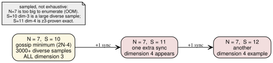

# When everyone has heard from everyone: how tangled does the story get?

*Who this is for: engineers and scientists comfortable with distributed systems
and a little discrete math, but not with order-dimension theory or this project's
notation. No prior reading required.*

---

## The hook

Picture a handful of people who can only learn things by talking to each other,
two at a time. You let them gossip until everyone's news has reached everyone
else. Then you ask a simple-sounding question: **how tangled is the resulting
web of "who-knew-what-before-whom"?**

There's a precise number for "how tangled" — the **order dimension** — and it
behaves in two ways nobody would guess. First: making people gossip *more* can
make the web *less* tangled. Second: the tangle grows astonishingly slowly with
crowd size. With up to six people it never exceeds a tangle of 3. The first time
you genuinely *need* a tangle of 4 is at **seven people** — and even then, only
if they gossip with maximum efficiency. One extra conversation beyond the bare
minimum is what unlocks it.

This note explains what those numbers mean and how we know them.

---

## The setup: gossip as a partial order

The objects of study come from a tiny model of a distributed system. You have
**N processes** — think of them as N people. Each person lives on their own
timeline, doing one thing after another. Occasionally two of them **synchronize**:
they meet, swap everything they each know, and then carry on. A synchronization
is just a pair of people, and an *execution* is N people plus an ordered list of
these pairwise meetings.

Each meeting weaves the two timelines together. After A and B sync, anything that
happened on A's timeline before the meeting is now also in B's past, and vice
versa. So an execution expands into a web of events where some events provably
came **before** others (they're connected through the chain of meetings) and
some are **concurrent** — neither could have influenced the other. That
"definitely came before" relation is the classic **happened-before** order from
distributed systems, and it is a *partial* order: not every pair of events is
comparable.

Here is one real execution from this dataset — four people, four meetings, in the
order (P0,P1), (P2,P3), (P0,P2), (P1,P3):

The blue boxes on the left are everyone's *start*; the orange boxes on the right
are everyone's *last event*. This particular execution is **fully frontier
synchronized**: every person's start lies in the causal past of every person's
last event. In plain terms — by the end, everyone's opening news has reached
everyone. That "the whole opening frontier is seen by the whole closing frontier"
condition is the family of executions this folder studies.

---

## The idea: order dimension, the tangle number

So we have a partial order — some events before others, many concurrent. How do
we measure how complicated it is?

The trick is to ask: **how many simple timelines would you need to reconstruct
it?** A *single* timeline is a total ordering — line every event up, no ties. One
timeline can't capture concurrency, because it forces an order on events that
were really independent. But you can overlay several timelines and read off only
what they *agree* on. The **order dimension** is the smallest number of timelines
whose agreement reproduces the true order exactly: X comes before Y in *every*
timeline precisely when X really happened before Y.

Dimension 2 means two timelines suffice — a fairly flat, grid-like order.
Dimension 4 means you genuinely need four independent viewpoints before their
overlap pins down the truth; the order has a richer, more interlocked structure
that no three rankings can capture. **Bigger dimension = more tangled.**

There's an easy upper bound for our gossip orders: vector clocks give each event
an N-coordinate timestamp, so the dimension can never exceed N, the number of
people. The interesting question is how far *below* that ceiling reality sits.

---

## Result 1: more gossip can mean *less* tangle

Intuitively you'd expect that piling on more synchronizations only ever
complicates the causal web. The opposite happens.

Take five people. The *cheapest* way to get everyone fully in the loop uses **6**
meetings — and that minimal execution has dimension **3**. If you spend one
*extra* meeting (7 total), you can reach a *fully synchronized* execution of
dimension **2**. Adding a sync **lowered** the dimension.

The same pattern holds at N=4: the 4-sync minimum is dimension 3, while
dimension 2 costs 5 syncs. The intuition the researchers offer: when meetings are
scarce, *all* the causality has to funnel through a few hub events, and that
lopsided merge pattern is what forces a higher dimension. An extra meeting lets
the structure become more balanced and grid-like — and a balanced grid is exactly
what a 2-dimensional order looks like. **Fewer meetings → more skew → higher
dimension.** So "use the fewest syncs" and "keep the order simplest" are
*competing* goals, which is genuinely counterintuitive.

(One practical footnote from the findings: the default enumerator in this toolkit
throws away anything above dimension 2, so it never even *sees* these cheap
high-dimensional minima and over-reports how many syncs you need. The effect only
shows up once you keep every dimension.)

---

## Result 2: the tangle grows one notch every couple of people

Now the headline. How large can the dimension get as the crowd grows?

The vector-clock ceiling says "up to N." Reality climbs far more slowly:

- **Two or three people:** dimension is always **2**.
- **Four, five, or six people:** the maximum is **3**. Dimension 3 first shows up
  at N=4 and then holds steady across N=5 and N=6.
- **Seven people:** the maximum reaches **4** for the first time.

So the tangle goes up by one notch roughly every two extra people — 2, then 3,
then 4 — while the ceiling N races ahead untouched. At seven people the order
*could* in principle reach dimension 7; it only ever reaches 4.

---

## Result 3: seven is the first interesting number

There's a sharper twist hiding inside N=7.

For four, five, and six people, the highest-dimensional execution was always the
*cheapest* one — the bare-minimum-sync execution was itself the most tangled.
(The minimum number of syncs to fully synchronize N people is the **gossip
number**, 2N−4.) You might expect that rule to continue.

It doesn't. At seven people the gossip-minimum is **S = 10** syncs — and every
one of those minimal executions is only dimension **3**. Dimension **4** does not
appear until you spend **one extra** sync, at **S = 11**.

That is the precise sense in which "seven is the first interesting number of
gossipers": it's the first crowd size where the most tangled possible story is
*not* the most efficient one — where you have to pay a premium of one conversation
above the optimum to buy the extra dimension.

---

## How we know (and what's still a sample, not a proof)

The honesty here matters, because the different results rest on different
strengths of evidence.

For the **small cases the claims are exhaustive.** For N=4, *every* execution
shape up to 10 syncs was generated and classified — all 134,116 of them — and not
one exceeds dimension 3. For N=5, the same was done for every shape up to 8 syncs
(17,008 of them). These are complete sweeps, not samples: within those bounds,
dimension 4 simply does not exist.

For **N=6**, full synchronization first happens at 8 syncs, and all 107 distinct
minimal shapes were checked and found to be dimension 3. Here the toolkit's fast
brute-force method choked on a few large cases — 3 of the 107 *looked* like they
might be dimension 4 because the colorer couldn't quickly handle their 65-plus
critical pairs. A sound SMT solver (z3) settled it: all three are dimension
exactly 3. A worthwhile cautionary tale baked into the findings — *"slow to
compute" is not evidence of "high dimension."* Dimension is decided by directly
asking z3 whether the order can be built from *t* timelines; an unsatisfiable
answer at *t*=3 would be a genuine proof of dimension ≥ 4.

For **N=7 the evidence is necessarily weaker, and the findings say so plainly.**
Seven people generate too many events to enumerate exhaustively — the machine
runs out of memory. So the dimension-4 examples were found by randomized,
memory-light random walks that stop at the first full synchronization, and each
specific example *is* z3-verified to be dimension 4 exactly (the S=11 and S=12
executions are both proven, with the t=3 check coming back unsatisfiable). But the
claim that the gossip-minimum **S=10 layer never reaches dimension 4** is a
**large diverse sample, not a proof**: 3000-plus deliberately varied optimal S=10
constructions plus efficiency-biased samples were all dimension 3. None of the
N≤6 results are in any doubt; the "S=10 is capped at dimension 3" statement is the
one place to keep the word *sampled* firmly attached.

---

## What's still open

- **Is N=7's S=10 layer *provably* capped at dimension 3?** Right now it's a
  strong sample. An exhaustive argument (or a clever enumeration that fits in
  memory) would turn the most striking claim from "observed across thousands of
  cases" into "proven."
- **Where does the staircase go next?** Dimension is 2, then 3, then 4 at N=2/3,
  4–6, 7. Does it keep stepping up roughly every couple of people, or does the
  pattern shift? N=8 and beyond are uncharted here.
- **Why does full synchronization avoid the high-dimensional standard examples?**
  Reaching dimension 4 normally means embedding a known 4-dimensional structure,
  and these chain-of-pairwise-meeting orders don't seem to produce it until N=7.
  *Why* the gossip structure resists high dimension for so long is, as the
  findings put it, the open conceptual question underneath all the numbers.

---

*Sources: `FINDINGS.md`, `SUMMARY.md`, `EXAMPLES.md` in this folder, and the
verified example executions (`N2_S1_dim2_real2_01.yaml`,
`N4_S4_dim3_real1000cap_01.yaml`, `N5_S6_dim3_real1000cap_01.yaml`,
`N6_S8_dim3_z3_01.yaml`, `N7_S10_dim3_z3_01.yaml`, `N7_S11_dim4_z3_01.yaml`,
`N7_S12_dim4_z3_01.yaml`). Reproduce with `generate.py`, `confirm_dim.py`,
`classify_z3.py`, `hunt_n7.py`, `min_s_dim4.py`, `constructive_s10.py`.*
