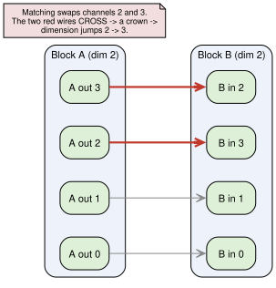
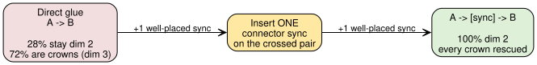
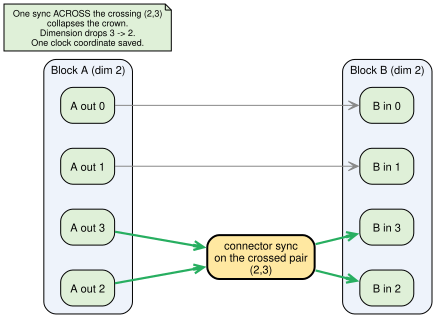

# Counting the crossings: how many syncs it takes to untangle a "crown"

*Who this is for: engineers and scientists comfortable with distributed systems
and a little discrete math, but not with order-dimension theory or this project's
notation. If you've read the companion piece `EXPLAINER.md` you're more than
ready; if not, the next section recaps everything you need.*

---

## The hook

You have two distributed-system executions that are each *cheap* — each can be
timestamped with a clock of just **two** numbers per event instead of one per
process. You glue them together end to end, expecting the result to stay cheap.
Most of the time it doesn't: gluing two cheap things accidentally creates a
**crown**, an obstruction that drags the cost up to a *third* coordinate.

The fix is almost comically small — and it turns out to follow a clean law. The
way you glue the two executions is a *shuffle* of their channels (a permutation),
and that shuffle's **crossings** are what create the crown. **Each crossing costs
exactly one extra synchronization to undo.** A simple swap of two channels: one
sync. A three-way rotation: two syncs. A full N-way scramble: N − 1 syncs. In one
line:

> **recovery length = number of crossings in the gluing = N − (number of cycles
> in the shuffle).**

And the punchline that makes it a *law* rather than a measurement: it is
**independent of N**. The very same repair works whether you have 4 processes or
8, because the repair lives entirely on the channels that moved.

The simplest case — a single swap, fixed by a single sync — is where this story
started (for 4 processes); the general law is where it ends. That's the arc
below.

---

## The setup (recap in one screen)

A tiny model of a distributed system. You have **N processes** — think of them
as N people, each on their own timeline. Occasionally two of them
**synchronize**: they meet, swap everything they know, and carry on. An
*execution* is N people plus an ordered list of these pairwise meetings.

Each meeting weaves two timelines together, so an execution expands into a web of
events where some provably **happened before** others and some are
**concurrent**. That happened-before relation is a **partial order** (a *poset*).

How tangled is that poset? The measure is its **order dimension**: the fewest
plain timelines whose *agreement* reconstructs the true order — X is before Y in
*every* timeline exactly when X really happened before Y. Dimension 2 means a
flat, grid-like order that two timelines pin down; dimension 3 means you
genuinely need a third independent viewpoint.

Why care? **The order dimension is the number of coordinates a minimal logical
clock needs.** A vector clock spends `N` numbers per event (one per process); a
poset of dimension `d` can be faithfully timestamped with just `d`. So
"dimension 2 vs 3" is literally "two-number clock vs three-number clock." That
gap — sub-vector-clock memory — is this project's north star.

One more piece of vocabulary. We only look at executions that are **fully
frontier-synchronized**: by the end, *everyone's* opening news has reached
*everyone*. The opening events form the **input frontier**, the closing events
the **output frontier** — each a set of N channels, one per process.

---

## The building blocks

Fix **N = 4**. The cheapest fully-synchronized executions that are still
dimension 2 use exactly **5 syncs**, and there are exactly **10** of them. These
are the **blocks** we'll compose. Two archetypes do all the work:

- **The star** `(0,1)(0,2)(0,3)(0,2)(0,1)` — everyone reports in to hub 0, then
  hub 0 scatters the merged news back out. (Called `B1`.)
- **The two-pairs** `(0,1)(2,3)(0,2)(0,1)(2,3)` — two independent pairs that mix
  through a middle sync. (Called `B9`.)

Both are dimension 2 — a two-coordinate clock each. They're the cheap parts we
want to keep cheap.

---

## Composing two blocks: the crown appears

Now glue block A to block B. A finishes with an output frontier of 4 channels; B
starts with an input frontier of 4 channels. To compose them you wire A's outputs
to B's inputs — but a frontier is an *unordered* set, so there are `4! = 24` ways
to do the wiring. Each wiring is a **matching**.

Two facts fall out of trying all of them (100 ordered pairs of blocks × 24
matchings = **2400** composed executions, with each dimension decided by the
**z3 SMT oracle**):

- The composition stays fully synchronized automatically. Good.
- But **only 28% (672 of 2400) stay dimension 2.** The other **72% (1728) jump to
  dimension 3.**

That dimension-3 case has a name: a **crown**. It's a specific frontier
*crossing* — wire two channels so they cross, and you've embedded an S₃-type
obstruction that forces dimension ≥ 3. (This is the empirical face of the Coq
theorems on `dev`: `threshold_dim_le2` says a non-crossing frontier keeps
dimension ≤ 2, and `crown3_dim_ge_3` says an S₃-crown frontier forces
dimension ≥ 3.)

Here's the cleanest crown — the star block glued to *itself*, but with channels 2
and 3 swapped:



The same blocks with a *non*-crossing (identity) matching stay dimension 2. So
**the matching is the whole story**: the blocks are innocent, the wiring is
guilty. Up to isomorphism, all those crowns collapse to just **5 classes** — two
pure-star, two star/two-pairs duals, and one pure two-pairs.



---

## The rescue, simplest case: one sync, on exactly the crossed pair

Here is the heart of the piece. Instead of gluing A's output frontier *directly*
to B's input frontier, slip a short **connector** of a few syncs in between:
`A.syncs + connector + matched(B.syncs)`. The connector re-mixes the frontier
before B runs.

Start with the simplest crowns — the ones born from a matching that just *swaps
two channels* (a single transposition). For N = 4 *every* crown is of this kind,
and the headline is:

| connector | dim-2 variants (of 2400) |
|-----------|--------------------------|
| none (direct glue) | 672 = **28%** |
| **one sync** | **2400 = 100%** |

**A single connector sync rescues every N = 4 crown back to dimension 2.** All
five crown classes, gone. 28% → 100%.

But — and this is the non-obvious part — it has to be the *right* sync. A generic
single connector typically rescues a given crown only **1 in 6** of the time (one
class allows 2 of 6). The rescuing sync is not arbitrary: **it is a sync on
exactly the pair of processes that the matching crossed** — the *crossed pair*.

| crown class | matching swaps | rescuing connector(s), of 6 |
|-------------|----------------|------------------------------|
| #1  star;star | 2 ↔ 3 | `(2,3)` |
| #2  star;star | 1 ↔ 2 | `(1,2)` |
| #3  star;two-pairs | 1 ↔ 2 | `(1,2)` |
| #4  two-pairs;star | 1 ↔ 2 | `(1,2)` |
| #5  two-pairs;two-pairs | 1 ↔ 2 | `(1,2)` **and** `(0,3)` |

Every crown here is born from a matching that *transposes two channels*, and the
unique rescuing connector is a sync on *precisely those two crossed processes*.
Put one synchronization across the crossing and the crossing collapses — the
order falls back to two dimensions. One clock coordinate, bought back.



The concrete witness, verified dimension 2 by both z3 *and* nomadim's independent
brute force (`N4_connector1_rescue_dim2.yaml`):

```
(0,1)(0,2)(0,3)(0,2)(0,1)   (1,2)   (0,2)(0,1)(0,3)(0,1)(0,2)
                            ^^^^^
                         the connector
```

That whole thing is dimension 2. **Remove the middle `(1,2)` and it's the
dimension-3 crown.** One sync is the entire difference between a two-number clock
and a three-number clock.

This single-swap case is just the smallest instance of a much cleaner law — the
next section.

---

## The general law: one sync per crossing, the "fan" connector

A frontier matching is a **permutation** of the N channels: each output channel
of A is wired to some input channel of B. A swap of two channels was the simplest
permutation, but the gluing can scramble the channels any way at all. The
question that opens up for larger N: *how much repair does a more tangled gluing
need?*

Push past N = 4 — to N = 5, 6, 7, 8 — and a clean answer falls out. First, recall
that every permutation breaks into independent **cycles**: `(1 2)` is a 2-cycle (a
swap), `(1 2 3)` is a 3-cycle (a rotation of three channels), and so on, up to the
full N-cycle that rotates everyone. The number of crossings a permutation
introduces is exactly its **number of transpositions** — and a d-cycle is d − 1
transpositions, no matter how you slice it.

The result: **the minimal connector that recovers dimension 2 is a "fan" of one
sync per transposition** — pick one channel of each cycle as the root, and sync it
once to each other channel of that cycle.

- a swap (2-cycle) → fan `(1,2)` → **1 sync**
- a 3-cycle → fan `(1,2)(1,3)` → **2 syncs**
- a d-cycle → fan `(1,2)(1,3)…(1,d)` → **d − 1 syncs**
- a double swap (2,2) → union of two fans `(1,2)(3,4)` → **2 syncs**
- the full N-cycle → fan `(1,2)(1,3)…(1,N)` → **N − 1 syncs**

A product of several disjoint cycles is just the union of their fans. Summing it
all up gives the law from the hook:

> **recovery length = number of transpositions of the matching
> = N − (number of cycles) = Σ over cycles (cycle length − 1).**


The single most surprising part is what *doesn't* appear in that formula: **N**.
The repair does not get harder as you add processes. A 3-cycle costs two syncs
whether you have 5 channels or 8, because the fan only touches the channels that
actually moved — the rest of the star carries on untouched. The same connector
file works verbatim at every N. The tangle of the gluing, not the size of the
system, sets the price.

And the N = 4 single-swap rescue from the previous section is now simply the
**d = 2** corner of this law: one transposition, one sync.

---

## When you *need* a longer connector — and why it still isn't free

The fan law says a d-cycle crown needs d − 1 syncs and no fewer. That number is a
genuine **minimum**, not just a recipe that happens to work: brute force confirms
a 3-cycle cannot be rescued by any single sync, a 4-cycle cannot be rescued by any
two, and below d − 1 the search comes up empty. So longer connectors aren't a
luxury for the d > 2 regime — they're mandatory. The deeper the cycle, the more
crossings, the more syncs.

But "mandatory" raises the same worry in reverse: once you're *allowed* a longer
connector, does the problem go soft — does almost any connector of the right
length work? It doesn't. Even at N = 4 (where every crown is a single swap, so
one sync *suffices*), letting yourself use connectors up to length 4 anyway shows
the pattern. Counting how many connectors of each length (L1 = 1 sync, up to
L4 = 4 syncs) rescue each crown:


Two things to read off it:

1. **The rescuer count grows with length, but the *fraction* stays flat
   (~10–22%).** It never runs away toward "anything works." Star crowns even
   drift slightly *down* (16.7% at L1 to 11.8% at L4); the two-pairs crown #5
   stays highest (33% down to 21%). A longer connector gives you proportionally
   more rescuers — not an easier puzzle.

2. **You still have to synchronize across one of the crown's crossings.** For the
   pure-star crowns (#1, #2) the crossed pair is *mandatory* through length 2 —
   the first connector that rescues *without* touching the crossed pair appears
   only at length 3 or 4, and there are just a handful (1 or 4 out of thousands).
   The two-pairs crowns (#3–#5) escape earlier because the `B9` block carries two
   independent groupings — `{0,1}` and `{2,3}` — and so has a **second equivalent
   crossing, the pair `(0,3)`**. Routing across *that* alternative crossing also
   works, and crossed-pair-free rescues climb (1 → 8 → 47 for #3/#4; 1 → 5 → 27 →
   131 for #5) — but they stay a minority at every length.

The conclusion is clean: **the crown's crossing structure is the gatekeeper at
every length.** Longer connectors only let you reach the *alternative* crossing
or take a roundabout route across the same one. You never get to ignore the
crossing.

---

## How we know (and what's sampled vs verified)

The dimensions here are decided by the **z3 SMT oracle**, the same tool used
throughout this folder: it asks directly whether the happened-before poset equals
the intersection of `t` timelines, and an unsatisfiable answer at `t = d−1` with
a satisfiable one at `t = d` pins the dimension to exactly `d`. The marquee
example (the `(1,2)`-rescued composition) was additionally confirmed by
nomadim's **independent brute-force** dimension algorithm — two methods, same
answer.

The N = 4 composition sweep is **exhaustive within its scope**: all 2400 `(A, B,
matching)` variants were generated and classified, not sampled, and the "28% stay
dim 2 / one sync → 100%" counts are exact over that set. The 5 crown classes and
5 dim-2 classes come from a Weisfeiler–Leman isomorphism signature on the
reachability closure. The crossed-pair and connector-length counts in the tables
are direct enumerations (`check_connector_pairs.py`, `check_connectors_len.py`).

The general fan law was checked by the same z3 oracle for **every cycle length
d = 2..N and every N = 5, 6, 7, 8** — including the 7-sync fan that rescues the
full 8-cycle. So the d − 1 length is a verified *achievable* bound everywhere; and
where brute force is feasible it is also the verified *minimum* (a 4-cycle needs
exactly 3 — the length-3 fan is 1 of 216 connectors — and length ≤ 2 fails;
for d ≥ 5 the length-≤-2 search likewise fails). The N-independence is read off
directly: the table is identical for N = 5 through 8. There are 52 stored witness
executions (26 crowns + 26 recoveries) under `connector_examples/`.

Two honest caveats carried from the source. First, for N ≥ 6 the full set of
dimension-2 blocks **cannot be enumerated**, so the **star** is used as the
representative block rather than checked against all blocks; for N = 5, where the
6-block / 120-matching scan *was* run over the actual enumerated blocks, it gave
the same picture (6% direct dim-2, 12 crown classes, all recovered). Second, a
small structural aside that the law predicts and the scan confirms:
**hub ↔ leaf swaps never crown** — swapping the central hub with a leaf is a
symmetry of the star, so it introduces no crossing at all. Everything claimed is
backed either by exhaustive enumeration or by the z3 oracle, with the N = 4
headline case additionally double-checked by nomadim's independent brute force.

---

## Why it matters

Composition is how you'd actually build big executions out of small, cheap ones —
stack a `√N`-coordinate-clock execution on top of another and hope the result
stays cheap. This result is the warning *and* the remedy:

- **The warning:** gluing two dimension-2 blocks is *usually* (72% of wirings at
  N = 4) a trap. A generic frontier alignment crosses into a crown and silently
  costs you a third clock coordinate.
- **The remedy:** that cost is repairable, and the price tag is a clean
  combinatorial invariant of how tangled the gluing was. Look at the matching as a
  permutation, count its crossings — `N − (number of cycles)` — and that many
  well-placed synchronizations, arranged as a fan over each cycle, collapse every
  crown and restore the two-coordinate clock.

So "dimension repair" isn't an abstraction here — it's a concrete operation with a
concrete, *N-independent* recipe: *decompose your matching into cycles, and lay a
fan of one sync per crossing over each.* The crown costs you a third clock
coordinate; the fan is the exact, minimal sequence of synchronizations that buys
the two-coordinate clock back — and its length tells you, at a glance, precisely
how tangled the gluing was.

---

*Sources: `CONNECTOR_SCAN.md` (the N = 5..8 transposition law, the cycle-type /
fan table, and the N-independence) and `COMPOSE_N4.md` (the authoritative N = 4
writeup, with the 2400-variant sweep, the 5 crown / 5 dim-2 classes, the
crossed-pair table, and the length-1–4 rescuer counts). Background: `FINDINGS.md`
(the order-dimension / √N story) and `EXPLAINER.md` (the companion piece).
Verified examples: `N4_connector1_rescue_dim2.yaml` and the 52 witnesses under
`connector_examples/`. Reproduce with `scan_connector_multi.py` (the N = 5..8
scan), `compose_n5_connector.py` (the N = 5 enumerated-block scan), `compose_n4.py`,
`compose_n4_connector.py`, `check_connector_pairs.py`, `check_connectors2.py`,
and `check_connectors_len.py`.*
